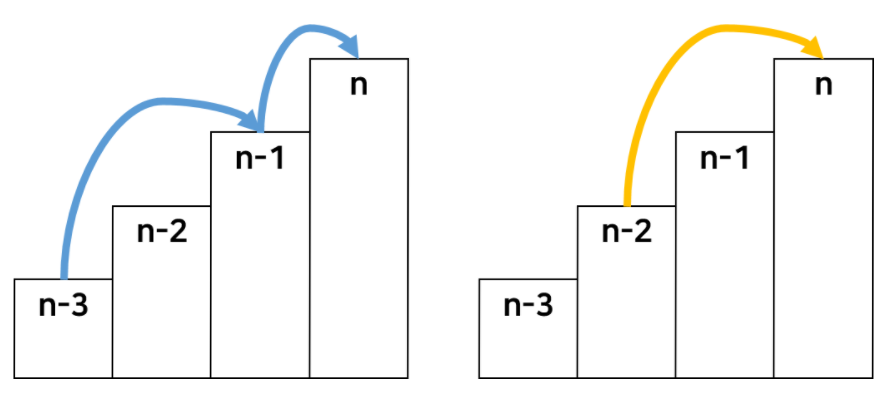

## 동적 계획법(DP)

### 동적 계획법 (Dynamic Programming)

<aside>
📌 복잡한 문제를 여러 개의 작은 부분 문제(Sub-Problem)로 나누어 해결하는 방법
  
</aside>
<br>
<br>

- 큰 문제를 작은 문제로 나눌 수 있음
- 작은 문제에서 구한 정답은 그것을 포함하는 큰 문제에서도 동일
- **'메모이제이션(Memoization)'** : 계산한 결과를 배열에 저장

> cf . 분할 정복 기법과 다름. 분할 정복 기법은 동일한 문제를 다시 푼다는 단점이 있음
> 

---

### 💡 메모이제이션(Memoization)

- 프로그래밍 할 때, **반복되는 결과를 메모리에 저장**해서 중복 호출 되었을 때, **한번 더 계산하지 않고** 메모리에 저장해둔 걸 가져와서 **재활용** 함
- **실행 시간과 메모리를 trade-off** 해줌
    - 시간이 적게 걸리는 대신 메모리를 좀 더 사용
        - 시간 복잡도 : O(N)
        

### 💡 DP 풀이 Tip

1. 실제 문제에 대한 조건 및 예시들을 문장으로 작성
2. 중복되는 부분을 찾아줌
3. `1번` 부분을 수식화 시킴 → **점화식**을 만듦!!
4. `2번` 부분을 메모이제이션 시켜서 중복을 없애고 계산
5. `3번` 과 `4번`을 재귀 or 반복문을 이용해서 구현

-> **점화식** : 어떤 수열의 일반항을 그 이전의 항들을 이용하여 정의한 식을 뜻합

---

### 📚 구현 방식

- **Top-Down**
    - 큰 문제를 작은 문제로 쪼개면서 품
    - **재귀**로 구현
- **Bottom-Up**
    - 작은 문제부터 차례대로 품
    - **반복문**으로 구현
    

---

### 💍 Top-Down

- 단점
    - 함수 호출에 대한 오버헤드가 발생
        - 재귀함수를 통해 구현되기 때문
- 장점
    - Memoization을 잘 활용하면 Bottom-Up 보다 훨씬 빠름

### 동작 과정

```
1. 큰 문제를 작은 문제로 나눈다.
2. 작은 문제를 푼다.
3. 작은 문제를 풀었으니, 이제 큰 문제를 푼다.
```

### 예시 코드

```java
Func(n) = Func(n-1) + Func(n-2);
```

---

### 💍 Bottom-Up

- 단점
    - 모든 부분 문제를 해결해야 함
        - 큰 문제를 해결하기 위해서 어떤 Sub Problem이 요구되는지 모르기 때문
- 장점
    - for문으로 구현되므로 자원에 비교적 자유로워서 시간 및 메모리의 최적화가 쉬움

### 동작 과정

```
1. 문제를 크기가 작은 문제부터 차례대로 푼다.
2. 문제의 크기를 조금씩 크게 만들면서 문제를 점점 푼다.
3. 작은 문제를 풀면서 왔기 때문에, 큰 문제는 항상 풀 수 있다.
4. 반복하다 보면 가장 큰 문제를 풀 수 있다.
```

### 예시 코드

```java
DP[1] = 1;
DP[2] = 1;
 
for(int i=3;i<N;i++)
    DP[i] = DP[i-2] + DP[i-1];
```

---

### ✍ DP 종류

1. Coin Change Problem
2. KnapSack
3. LCS
4. LIS
5. Edit Distance
6. Matrix Chain Multiplication

---

### 🎄 예시



- 계단 점수의 배열 stair
- 해당 계단의 위치까지의 최고 점수의 값의 배열 score

**→ score[n] = Math.max(score[n-3] + stair[n-1], score[n-2]) + stair[n]**

[ 이미지 출처 ] : [https://girawhale.tistory.com/3](https://girawhale.tistory.com/3)
